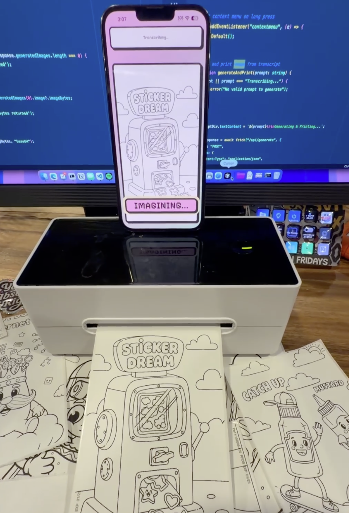

# Sticker Dream



A voice-activated sticker printer. Press and hold the button, describe what you want, and it generates a black and white coloring page sticker that prints to a thermal printer.

## How it works

1. Hold the button and speak (max 5 seconds)
2. Whisper transcribes your voice
3. Google Imagen generates a coloring page based on your description
4. Image displays in browser and prints to USB thermal printer

## Setup

1. Install dependencies:

```bash
pnpm install
```

2. Create `.env` file:

```
GEMINI_API_KEY=your_api_key_here
```

3. Connect a USB thermal printer. Currently only supports USB printer in MacOS - I would like to get this running with bluetooth or a receipt printer instead.

## Running

Start the backend server:

```bash
pnpm server
```

Start the frontend (in another terminal):

```bash
pnpm dev
```

Open `http://localhost:5173`
